# Options Academy - UML Architecture Diagrams

This document contains UML diagrams representing the system architecture. Diagrams are written in PlantUML format and can be rendered using:
- [PlantUML Online Server](https://www.plantuml.com/plantuml)
- VS Code PlantUML Extension
- JetBrains IDE PlantUML Plugin

---

## Table of Contents

1. [System Context Diagram](#1-system-context-diagram)
2. [Component Diagram](#2-component-diagram)
3. [Deployment Diagram](#3-deployment-diagram)
4. [Class Diagrams](#4-class-diagrams)
5. [Sequence Diagrams](#5-sequence-diagrams)
6. [State Diagrams](#6-state-diagrams)
7. [Use Case Diagram](#7-use-case-diagram)
8. [Entity Relationship Diagram](#8-entity-relationship-diagram)

---

## 1. System Context Diagram

Shows the system boundaries and external actors/systems.

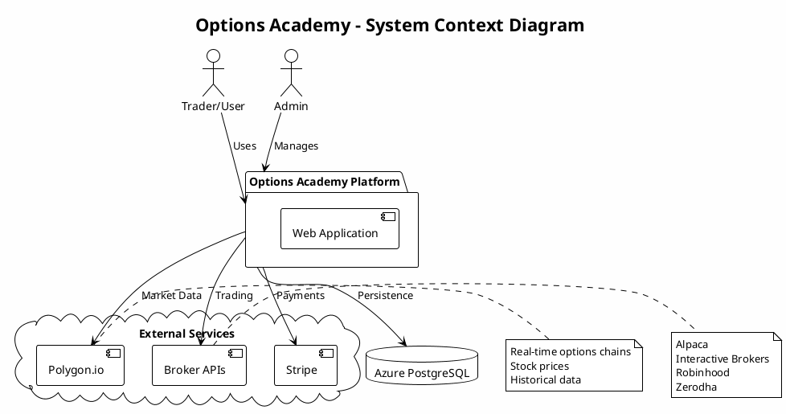

---

## 2. Component Diagram

Shows the main components and their relationships.

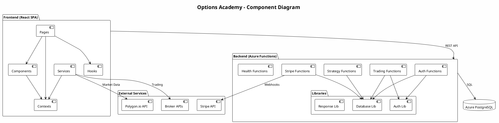

---

## 3. Deployment Diagram

Shows the physical deployment architecture.

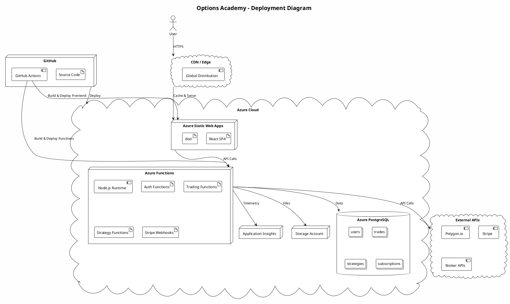

---

## 4. Class Diagrams

### 4.1 Frontend State Management

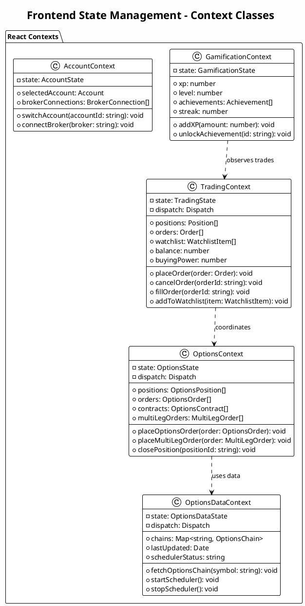

### 4.2 Backend Service Classes

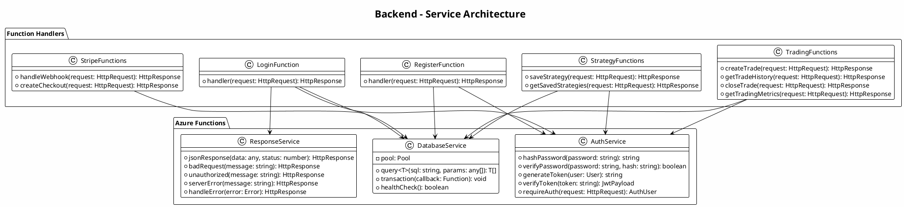

### 4.3 Domain Models

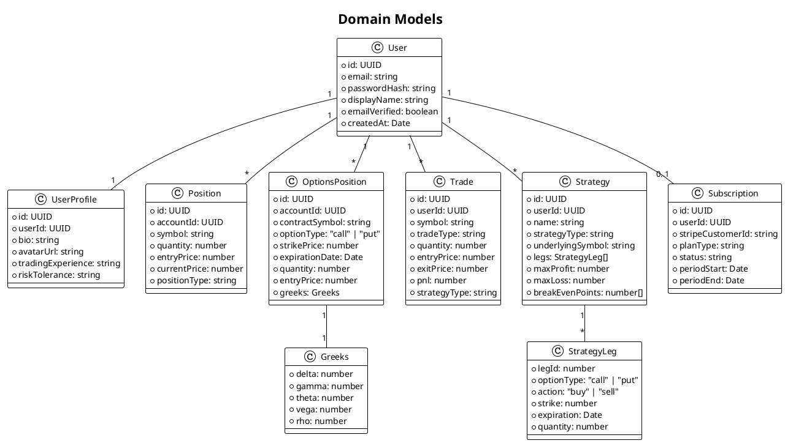

---

## 5. Sequence Diagrams

### 5.1 User Authentication Flow

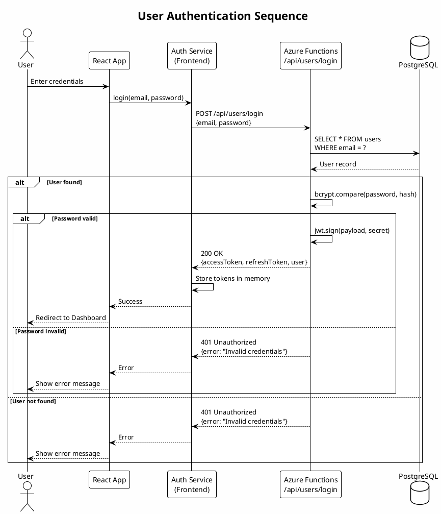

### 5.2 Options Trading Flow

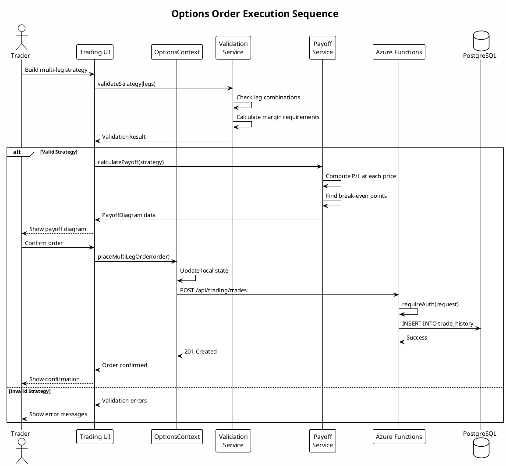

### 5.3 Real-time Data Flow

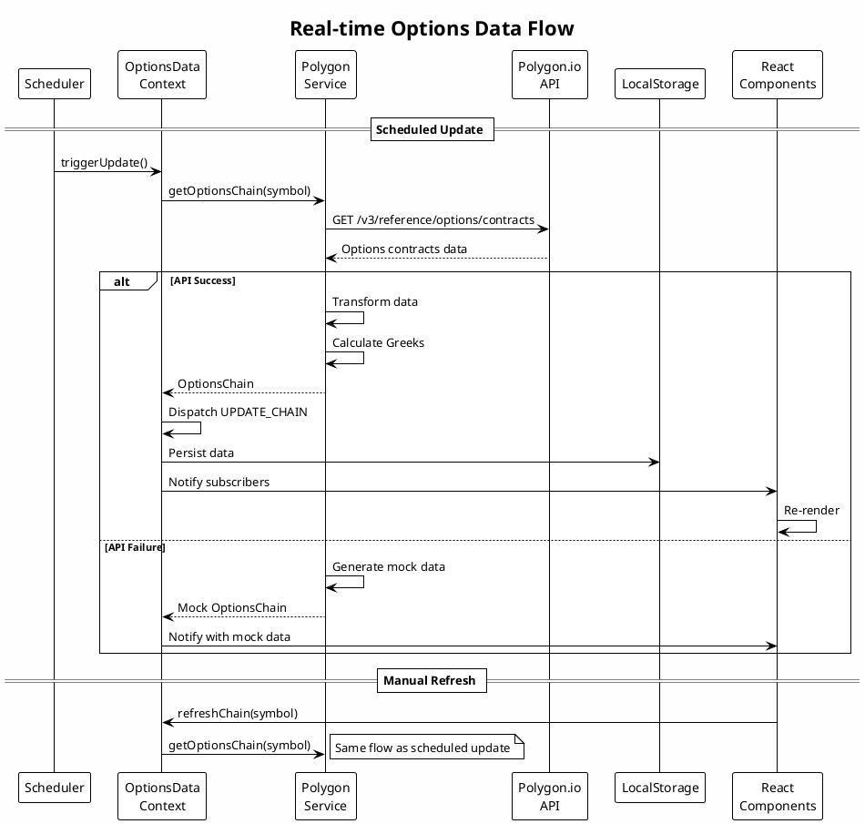

### 5.4 Stripe Payment Flow

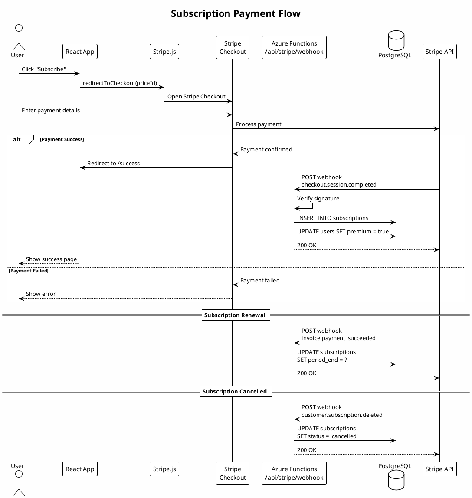

---

## 6. State Diagrams

### 6.1 Order Lifecycle

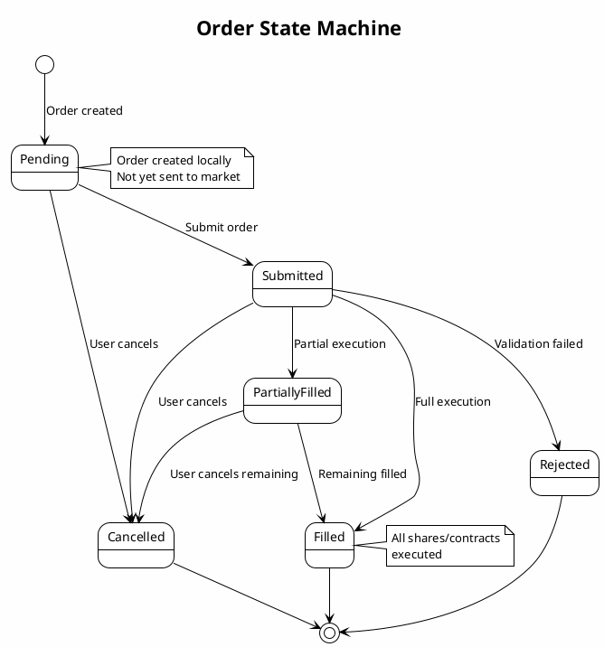

### 6.2 User Session State

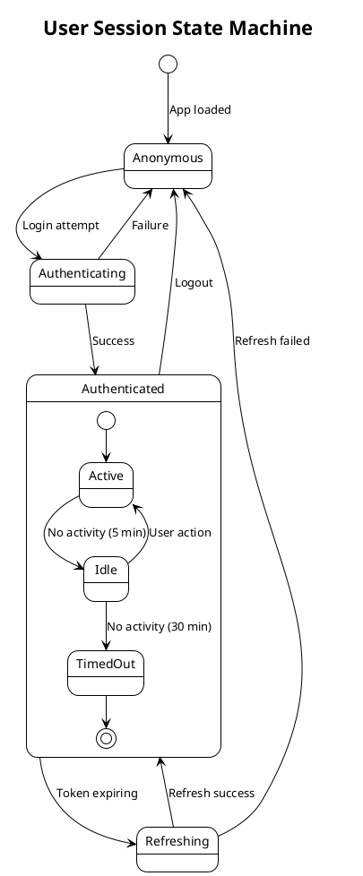

### 6.3 Options Position Lifecycle

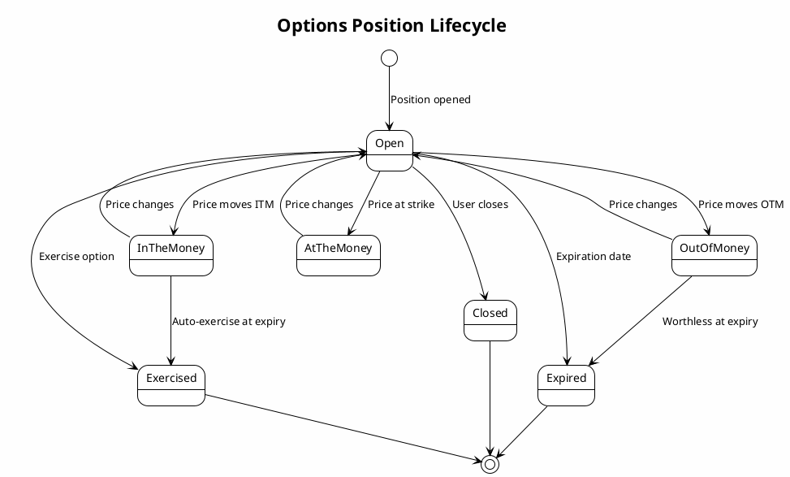

---

## 7. Use Case Diagram

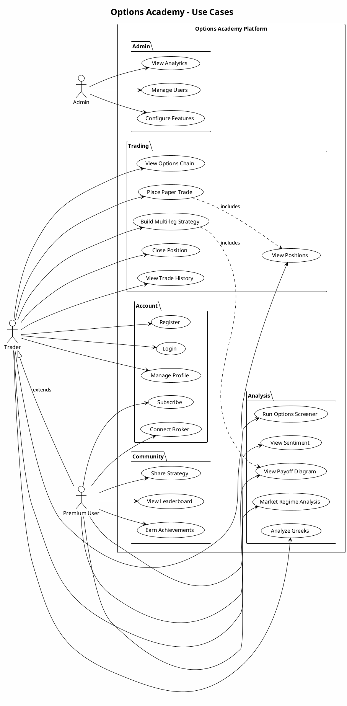

---

## 8. Entity Relationship Diagram

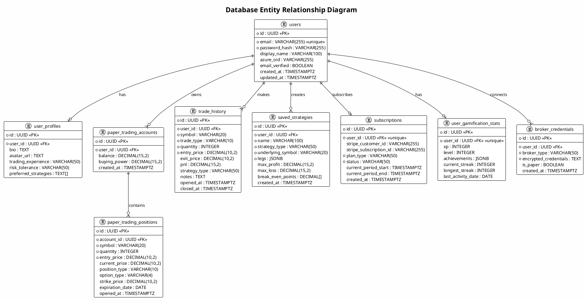

---

## Rendering the Diagrams

### Option 1: PlantUML Online Server

1. Go to [https://www.plantuml.com/plantuml](https://www.plantuml.com/plantuml)
2. Copy the PlantUML code (between \`\`\`plantuml and \`\`\`)
3. Paste into the editor
4. View/download the rendered diagram

### Option 2: VS Code Extension

1. Install "PlantUML" extension by jebbs
2. Open this file
3. Press `Alt+D` to preview diagrams
4. Export as PNG/SVG

### Option 3: Generate All Diagrams

```bash
# Install PlantUML
npm install -g node-plantuml

# Generate all diagrams
plantuml docs/architecture-uml.md -o docs/diagrams/
```

### Option 4: Mermaid Alternative

For GitHub rendering, convert to Mermaid syntax which renders natively in GitHub markdown.

---

## Diagram Summary

| Diagram | Purpose |
|---------|---------|
| System Context | High-level system boundaries |
| Component | Internal component relationships |
| Deployment | Physical infrastructure |
| Class (Contexts) | Frontend state management |
| Class (Services) | Backend service architecture |
| Class (Domain) | Core business entities |
| Sequence (Auth) | Authentication flow |
| Sequence (Trading) | Order execution flow |
| Sequence (Data) | Real-time data updates |
| Sequence (Payment) | Subscription flow |
| State (Order) | Order lifecycle |
| State (Session) | User session states |
| State (Position) | Options position lifecycle |
| Use Case | System capabilities |
| ERD | Database schema |

---

*Generated: December 2024*
